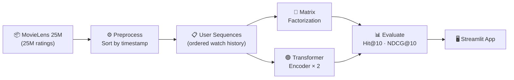
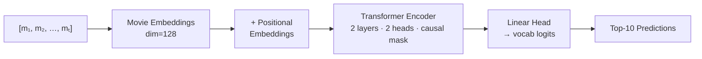

# Sequence-Based Movie Recommender

Comparing **Matrix Factorization** (order-agnostic baseline) against a **Transformer encoder** that models the temporal dynamics of watch history.  Trained on [MovieLens 25M](https://grouplens.org/datasets/movielens/25m/) (25 million ratings, ~162,000 users, ~62,000 movies).

A portfolio-ready Streamlit app with a live demo, side-by-side metrics, and a non-technical explainer.

---

## Architecture



### Matrix Factorization (Baseline)

Each user and movie gets a 64-dimensional embedding. Predicted affinity = dot product of user × movie vector. Trained with MSE loss on all observed (user, movie) pairs. At inference, all movies are ranked by dot product and the top-K are returned.

**Limitation:** treats every rating equally regardless of when it happened. A user who loved action films 5 years ago but now only watches slow dramas still gets action recommendations.

### Transformer Recommender



| Component | Value | Rationale |
|---|---|---|
| Embedding dim | 128 | Dense enough for ~62k vocab without over-parameterising |
| Layers | 2 | Captures 2nd-order context; faster than 4+ |
| Attention heads | 2 | Two independent patterns (genre, recency) |
| FFN dim | 256 | Standard 2× embed_dim |
| Window size | 10 | Focuses on most recent viewing context |
| Causal mask | ✓ | Position t attends only to positions ≤ t |
| Loss | CrossEntropyLoss | Next-item prediction (same as language modelling) |
| Optimizer | Adam, lr=1e-3 | Adaptive; gradient clipping at norm=1.0 |

---

## Results

Evaluated on the held-out **last 3 movies** per user (3 queries × ~162k users).  Both models rank the full ~62k movie vocabulary per query.

| Model | Hit@10 | NDCG@10 |
|---|---|---|
| Matrix Factorization | — | — |
| Transformer | — | — |

> _Run `python scripts/evaluate.py` after training to populate this table._

**Hit@10** — fraction of (user, test_movie) pairs where the test movie appears in the model's top-10 ranked list.
**NDCG@10** — position-weighted variant: a hit at rank 1 scores higher than a hit at rank 10.

---

## Tech Stack

| Layer | Library |
|---|---|
| Deep learning | PyTorch ≥ 2.1 |
| Data processing | pandas, NumPy |
| Metrics | scikit-learn, standard Python |
| App | Streamlit ≥ 1.32 |
| Charts | Plotly |
| Diagrams | Mermaid.js (CDN, rendered client-side) |
| Dataset | MovieLens 25M (GroupLens) |

GPU/MPS acceleration is used automatically when available.

---

## Setup

**Requirements:** Python 3.11+, ~4 GB disk for dataset.

```bash
# Clone and install
git clone https://github.com/<you>/movie-rec-transformer
cd movie-rec-transformer
pip install -r requirements.txt
```

### 1 · Download dataset

```bash
python scripts/download_data.py
# Downloads ml-25m.zip (~250 MB), extracts ratings.csv + movies.csv, deletes zip
```

### 2 · Preprocess

```bash
python scripts/preprocess.py
# Builds per-user ordered sequences, filters users with <20 ratings,
# splits last-3 movies as test set, serialises to data/processed/
```

### 3 · Train

```bash
# Baseline (fast — ~5 min on CPU)
python scripts/train_mf.py

# Transformer (~30 min on MPS/GPU, longer on CPU)
python scripts/train_transformer.py
```

Both scripts log loss every 1000 batches and save weights to `artifacts/`.

### 4 · Evaluate

```bash
python scripts/evaluate.py
# Computes Hit@10 and NDCG@10 for both models → artifacts/metrics.json
```

### 5 · Launch the app

```bash
streamlit run app/app.py
```

Open [http://localhost:8501](http://localhost:8501).

---

## Project Structure

```
movie-rec-transformer/
├── data/
│   ├── raw/                        # Downloaded CSVs (gitignored)
│   └── processed/                  # Serialised sequences + mappings (gitignored)
├── models/
│   ├── matrix_factorization.py     # MF model class
│   └── transformer_rec.py          # Transformer model class
├── scripts/
│   ├── download_data.py            # Fetch + unzip MovieLens 25M
│   ├── preprocess.py               # Sequence creation, filtering, split
│   ├── train_mf.py                 # Train MF baseline
│   ├── train_transformer.py        # Train Transformer
│   └── evaluate.py                 # Hit@10, NDCG@10 → metrics.json
├── app/
│   ├── app.py                      # Overview page (Streamlit entry point)
│   ├── pages/
│   │   ├── 1_Demo.py               # Live recommendation demo
│   │   ├── 2_Comparison.py         # Side-by-side metrics dashboard
│   │   └── 3_How_It_Works.py       # Non-technical explainer
│   └── utils/
│       ├── inference.py            # Model loading + inference helpers
│       └── visualizations.py       # Plotly charts, Mermaid HTML, CSS
├── artifacts/                      # Saved weights + metrics (weights gitignored)
├── requirements.txt
└── README.md
```

### How the files connect

`download_data.py` → `data/raw/ml-25m/{ratings,movies}.csv`
`preprocess.py` reads those CSVs → `data/processed/*.pkl` + `dataset_stats.json`
`train_mf.py` + `train_transformer.py` read sequences → save weights to `artifacts/`
`evaluate.py` loads both models + test sequences → `artifacts/metrics.json`
`app/utils/inference.py` loads everything lazily via `st.cache_resource`
`app/utils/visualizations.py` provides all charts and CSS consumed by all pages

---

## Dataset

F. Maxwell Harper and Joseph A. Konstan. 2015. [The MovieLens Datasets: History and Context](https://dl.acm.org/doi/10.1145/2827872). ACM Transactions on Interactive Intelligent Systems (TiiS), 5(4): 19:1–19:19.
